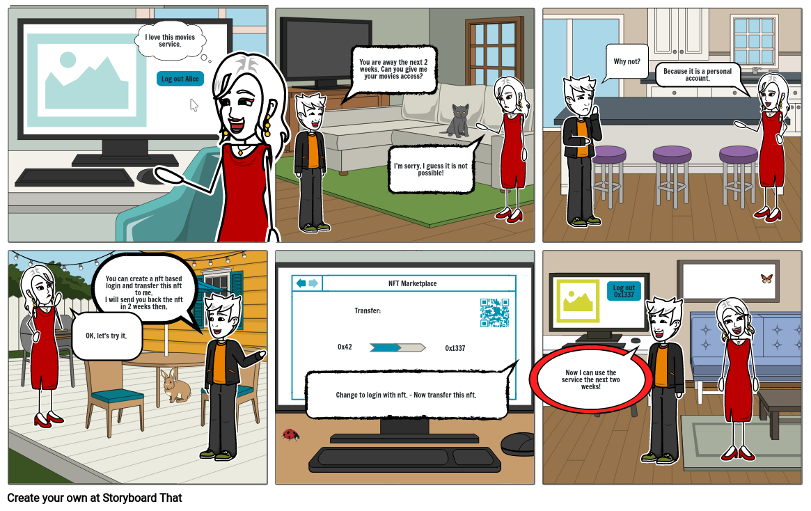

# nft-login

OIDC login for wallets owning an nft.

## context

Non fungible tokens are a proof for a digital ownership.
This ownership can be used to give access to any digital resource or service.

## What is it good for?

Todays online services access are mostly based on identities and not the ownership of an access authorisation.

This provider is a bridge between both worlds. The access is given based on the ownership of a nft.

## Functionality

- A nft will be created on the ethereum blockchain.
  The nft will be sold and the ownership will be transfered.

- The service has to configure an oidc-client to access nft-login.
  When the user visits the service, the user has to sign a proov for the owner address of the nft.

- If the user could sign the proof, nft-login will return the nft as id in the jwt-token.

## Claims

| Claim          | Example                                                                                                                                |
| -------------- | -------------------------------------------------------------------------------------------------------------------------------------- |
| sub            | '0x8f4f7365981a73dd61d5aa74cce4c0f251f67fac'                                                                                           |
| name           | 'anonymous'                                                                                                                            |
| email          | 'no-reply@example.com'                                                                                                                 |
| email_verified | false                                                                                                                                  |
| account        | '0x8f4f7365981a73dd61d5aa74cce4c0f251f67fac'                                                                                           |
| signature      | '0xb37a8dc999eb2dffbd4479e23d3efff079414a6ddb5f97a19d39471afc83c7007951266c4ea734bb43a217b751c3f78913ed011cb27a847ecc72e753194f30131c' |
| chain_id       | 256                                                                                                                                    |
| node           | 'https://http-testnet.hecochain.com'                                                                                                   |
| contract       | '0xa0d4E5CdD89330ef9d0d1071247909882f0562eA'                                                                                           |

## Test with oidcdebugger

Visit https://oidcdebugger.com and use https://nft-login.net/ as authorize uri.

Use as client id the nft contract address `0x420d2a6E87D87992EB01e5BFe762B3F437dBfD85`.

Connect with an account on kovan.

You must own a nft on https://devpavan04.github.io/cryptoboys-nft-marketplace/#/.

## Example

You can find an example, how to use the provider, for javascripts [express server](examples/expressjs/index.js).

## List of supported chains

| Chain                          | Authorize URI           | Contract to use as Client ID               | Marketplace to get NFT                                     | Faucet                                                                                        |     |
| ------------------------------ | ----------------------- | ------------------------------------------ | ---------------------------------------------------------- | --------------------------------------------------------------------------------------------- | --- |
| Kovan (42)                     | / or /default/authorize | 0x3B8270447b913d0b935e09d1C2daEc3F5CDD968f | https://devpavan04.github.io/cryptoboys-nft-marketplace/   | https://ethdrop.dev/                                                                          |     |
| OKExChain (65)                 | /okt/authorize          | 0xf0263c1D56A167cDCF72086071f96CbB8a077AE9 | https://nft-login.github.io/nft-login-marketplace/okt/     | https://okexchain-docs.readthedocs.io/en/latest/developers/quick-start.html#get-testnet-token |     |
| Clover (1023)                  | /clv/authorize          |                                            |                                                            | https://faucet.clovernode.com/                                                                |     |
| HECO Testnet (256)             | /heco/authorize         | 0xa0d4E5CdD89330ef9d0d1071247909882f0562eA | https://nft-login.github.io/nft-login-marketplace/heco/    | https://scan-testnet.hecochain.com/faucet                                                     |     |
| Celo alfajores (44787)         | /celo/authorize         | 0xBa4e569A5156C00348B89653968c2C294f80E151 | https://nft-login.github.io/nft-login-marketplace/celo/    | https://celo.org/developers/faucet                                                            |     |
| Polygon mumbai (80001)         | /polygon/authorize      | 0x8866afd737201d9Fcc16438b65f1E3db7A3A5Ddb | https://nft-login.github.io/nft-login-marketplace/polygon/ | https://faucet.polygon.technology/                                                            |     |
| Metis stardust (588)           | /metis/authorize        | 0x8866afd737201d9Fcc16438b65f1E3db7A3A5Ddb | https://nft-login.github.io/nft-login-marketplace/metis/   | https://rinkeby-faucet.metis.io/                                                              |     |
| Theta Testnet (365)            | /theta/authorize        | 0x8fb36197889f23E76e68E3FD57c6063A21DdE897 | https://market.nft-login.net/                              |                                                                                               |     |
| Avalanche FUJI C-Chain (43113) | /avax/authorize         | 0x51320F31d30c56c8107D82b4C67C5EdDfCa88bc2 | https://market.nft-login.net/                              | https://faucet.avax-test.network/                                                             |     |
| Binance Smart Chain (97)       | /binance/authorize      | 0x886B6781CD7dF75d8440Aba84216b2671AEFf9A4 | https://market.nft-login.net/                              | https://testnet.binance.org/faucet-smart                                                      |     |
|                                |                         |                                            |                                                            |                                                                                               |     |
|                                |                         |                                            |                                                            |                                                                                               |     |
